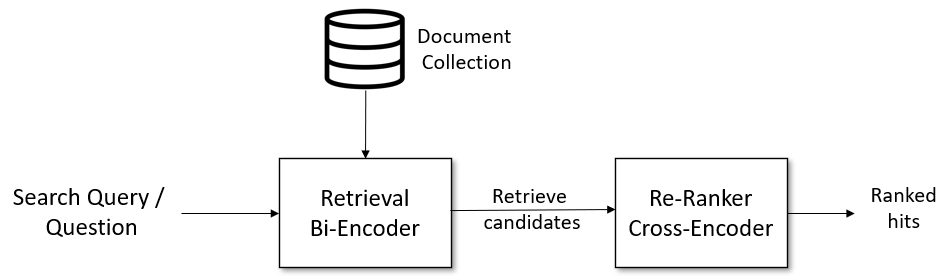
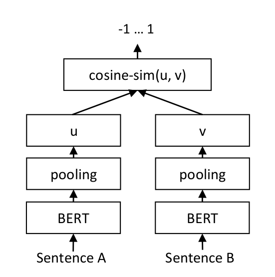
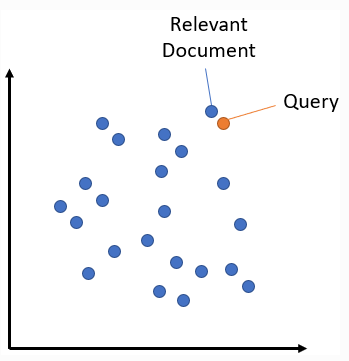
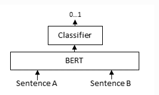
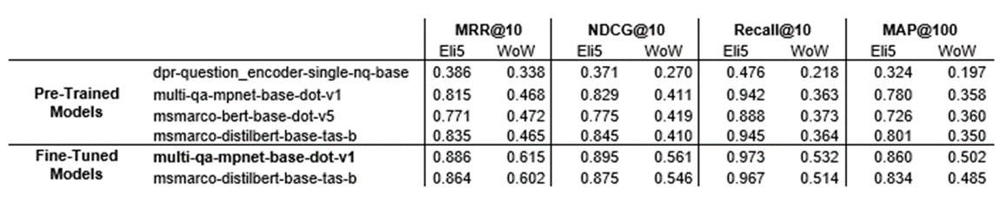
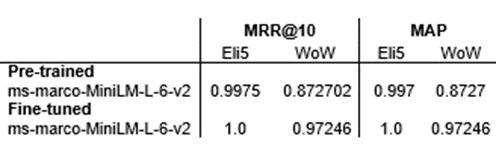

# Passage Retrieval
## Overview

The aim of passage retrieval is to find a passage that is most semantically similar to the input question or statement. The passage acts as supporting knowledge, which helps generate better responses. 

<p align="center">
  <a href="https://github.com/VectorInstitute/ConversationalAI/tree/main/passageretrieval">
    
  </a>
</p>
<p align="center">
  Figure 1. Passage Retrieval Pipeline
</p>

*The pipeline can be broken down into two steps:* 

##### 1. Passage Retrieval - Bi-Encoder 
    
The bi-encoder retrieves the most relevant passages from a knowledge base by performing a semantic search retrieval. The search is asymmetric, since the passages are significantly longer than the input query/statement. 

<p align="center">
    
    &ensp; &ensp; &ensp; &ensp; &ensp;
    
</p>
<p align="center">
  Figure 2. Bi-Encoder Architecture
  &ensp; &ensp;
  Figure 3. Semantic Search
</p>
The query and passages are encoded into fixed-size embeddings into the same vector space. At search time, the relevant passages are found by computing the similarity between embeddings. For this case, the similarity measure used was dot product, since this metric is better suited for cases where the passages are significantly longer than the query.

##### 2. Passage Re-Ranking - Cross-Encoder 

The re-ranker is implemented to further improve the search results of the bi-encoder. This is based on a cross-encoder, which is only suitable for a small set of passages. It scores the relevancy of the output passages from the bi-encoder for the given input and re-ranks the list of passages. Both the query and passage are passed simultaneously into the network, which performs attention across the query and document. 

<p align="center">
  <a href="https://github.com/VectorInstitute/ConversationalAI/tree/main/passageretrieval">
    
  </a>
</p>
<p align="center">
  Figure 4. Cross-Encoder Architecture
</p>

## Data Format

The passage retrieval model requires datasets that are directly grounded with knowledge. The following two datasets, each containing knowledge retrieved from Wikipedia, were used for passage retrieval:

##### 1. Eli5 

Source: [Hugging Face](https://huggingface.co/datasets/vblagoje/lfqa_support_docs)

The Eli5 dataset is made up of questions and answers from Reddit users about random topics. They are retrieved from the “Explain like I’m 5” Reddit posts. For each question and answer pair, there are relevant Wikipedia passages for supporting information. 

##### 2. Wizard of Wikipedia 

Source: [ParlAI](https://parl.ai/projects/wizard_of_wikipedia/)

The Wizard of Wikipedia data contains dialogs between two people. A chosen topic is associated with each dialog. The conversations are knowledge grounded in Wikipedia passages about the chosen topic. 

### Formatting 

The following scripts were used to format the Eli5 and Wizard of Wikipedia datasets:

  1. `eli5_formatting.ipynb` 
  2. `wizard_of_wikipedia_formatting.ipynb`

The resulting format must include the following fields: 

ID  |  input  |  passage
------------- | ------------- | -------------
27uz9i | how do plants avoid pollinating themselves? | Few plants self-pollinate without the aid of pollen vectors (such as wind or insects). The mechanism is seen most often in some legumes such as peanuts. In another legume, soybeans, the flowers open and remain receptive to insect cross pollination during the day. If this is not accomplished, ...
22306 | my favorite color is green. | Green is the color between blue and yellow on the visible spectrum. It is evoked by light which has a dominant wavelength of roughly 495570 nm. In subtractive color systems, used in painting and color printing, it is created by a combination of yellow and blue, ...

## Training 

Both the bi-encoder and cross-encoder were fine-tuned to achieve better retrieval and re-ranking results. 

The following scripts were used to create the train/test splits for each model: 

1. `bi-encoder/data_splits.ipynb` creates splits for the bi-encoder on Eli5 and Wizard of Wikipedia 
2. `cross-encoder/eli5_splits.ipynb` creates splits for the cross-encoder on Eli5 
3. `cross-encoder/wow_splits.ipynb` creates splits for the cross-encoder on Wizard of Wikipedia 

Fine tuning scripts: 

1. `bi-encoder/bi-encoder_tuning.ipynb` to tune the bi-encoder on either Eli5 or WoW
2. `cross-encoder/cross-encoder_tuning.ipynb` to tune the cross-encoder on either Eli5 or WoW

## End to End Interactive

`EndtoEnd.ipynb` is an interactive notebook for live retrieval and reranking. It works for both Eli5 and WoW. 

For the bi-encoder, it loads the best performing model and corresponding passage embeddings. The embeddings can be computed and saved for each model using `bi-encoder/compute_embeddings.ipynb.` 

For the cross-encoder, it loads the best performing model and reranks the passages from the bi-encoder.

## Evaluation 
`bi-encoder_eval.ipynb` is the evaluation script for the bi-encoder. Both pre-trained and fine-tuned model results can be saved into a .csv file. 
Below are the results for the bi-encoder. Four pre-trained models for dense passage retrieval were tested. The two best performing were used as the base models for further fine tuning. 

<p align="center">
  <a href="https://github.com/VectorInstitute/ConversationalAI/tree/main/passageretrieval">
    
  </a>
</p>
<p align="center">
  Figure 5. Passage Retrieval Results
</p>

`reranking_evaluator` is the evaluation script for the cross-encoder. It was modified from SentenceTransformers to include more metrics. The results are also written into a .csv file. An MS-Marco pre-trained model was used as the base model for the fine tuning. The results for both the original and tuned model are below. 

<p align="center">
  <a href="https://github.com/VectorInstitute/ConversationalAI/tree/main/passageretrieval">
    
  </a>
</p>
<p align="center">
  Figure 6. Re-ranking Results
</p>

<!-- Citations --> 
## References
```bibtex
@inproceedings{reimers-2020-Curse_Dense_Retrieval,
    title = "The Curse of Dense Low-Dimensional Information Retrieval for Large Index Sizes",
    author = "Reimers, Nils  and Gurevych, Iryna",
    booktitle = "Proceedings of the 59th Annual Meeting of the Association for Computational Linguistics and the 11th International Joint Conference on Natural Language Processing (Volume 2: Short Papers)",
    month = "8",
    year = "2021",
    address = "Online",
    publisher = "Association for Computational Linguistics",
    url = "https://arxiv.org/abs/2012.14210",
    pages = "605--611",
}

@inproceedings{reimers-2019-sentence-bert,
    title = "Sentence-BERT: Sentence Embeddings using Siamese BERT-Networks",
    author = "Reimers, Nils and Gurevych, Iryna",
    booktitle = "Proceedings of the 2019 Conference on Empirical Methods in Natural Language Processing",
    month = "11",
    year = "2019",
    publisher = "Association for Computational Linguistics",
    url = "http://arxiv.org/abs/1908.10084",
}
```

<!-- CONTACT -->
## Contact

Tania Sidhom - https://github.com/taniasidhom - taniasidhom@gmail.com
